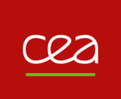

# Partners and Contributors

## List of contributors

Main developpers:

- [Emmanuelle Saillard](https://emmanuellesaillard.fr) (Research Scientist) - *Inria, France*
- [Philippe Virouleau](https://philippevirouleau.fr) (Research Engineer) - *Inria, France*
- Radjasouria Vinayagame (Ph.D student) - *Inria/Atos, France*

Other contributors:

- [Denis Barthou](http://www.labri.fr/perso/barthou/) (Full Professor) - *Bordeaux INP/Inria, France*
- Célia Tessadit Ait Kaci, *former Ph.D student at Inria/Atos, France*
- Marc Sergent (R&D HPC Runtime Systems Senior Expert), *Atos, France*
- Julien Jaeger (Research Scientist), *CEA, France*
- Patrick Carribault (Research Scientist), *CEA, France*
- Pierre Huchant (now engineer at Synopsis) *former Ph.D student of the Univ. of Bordeaux, France*
- Hugo Brunie (now Postdoc at Inria) *former Ph.D student at CEA, France*
- Van Man Nguyen, former Ph.D student at *CEA, France*
- Pierre-Antoine Rouby (Student at Univ. of Bordeaux) *intern at Inria from June 2021 to July 2021*
