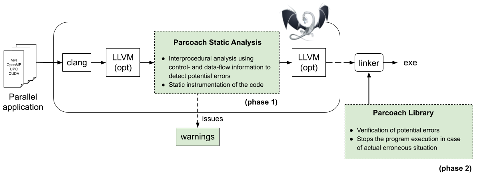

# PARallel COntrol flow Anomaly CHecker

**PARCOACH** is a **FOSS** (Free and Open-Source Software), with an LGPLv2.1 license, dedicated to the **collective errors detection** in parallel applications.

The main development repository with issues and merge request is hosted on Inria's GitLab, but a GitHub mirror is also available.

<a class="btn btn-success btn-lg" href="download.html" role="button">
  <i class="fas fa-download fa-lg" aria-hidden="true">&nbsp;</i>Download page
</a>

<a class="btn btn-primary btn-lg" href="https://gitlab.inria.fr/parcoach/parcoach" role="button" target="blank">
  <i class="fab fa-gitlab fa-lg" aria-hidden="true">&nbsp;</i>Source code on GitLab
</a>
<a class="btn btn-primary btn-lg" href="https://github.com/parcoach/parcoach" role="button" target="blank">
  <i class="fab fa-github fa-lg" aria-hidden="true">&nbsp;</i>GitHub mirror
</a>
