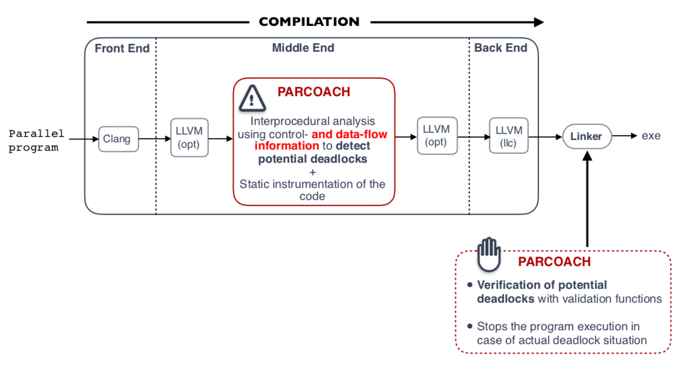

      

        <h1 class="display-4">PARallel COntrol flow Anomaly CHecker</h1>
        
<strong>PARCOACH</strong> is an <strong>Open-source</strong> software (LGPL license) dedicated to the <strong>collective errors detection</strong> in parallel applications.

          
        

        
The source code is freely available and hosted by GitHub.

        <a class="btn btn-primary btn-lg" href="https://github.com/parcoach/parcoach" role="button" target="_blank" style="margin-top:5px"><i class="fab fa-github fa-lg" aria-hidden="true">&nbsp;</i>Source code on GitHub </a>
      

    

